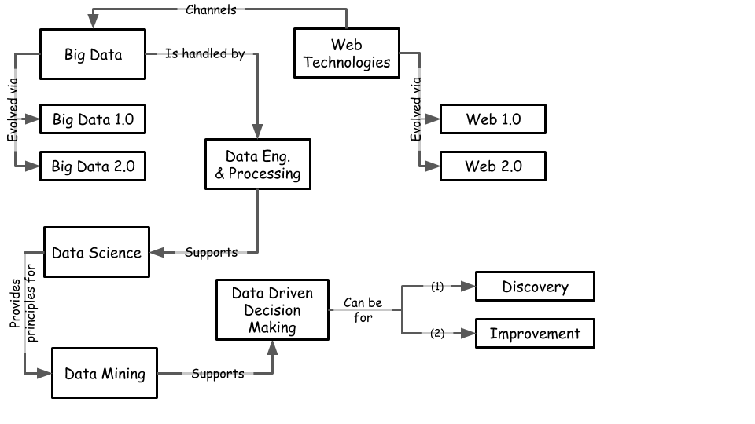

```{r message=TRUE, warning=TRUE, include=FALSE}
library(tidyverse)
library(plotly)
```


# Introduction to Predictive Modeling {#dm}

```{r lesson-fig, echo=FALSE, fig.align='center', fig.asp=.75, fig.cap='Lesson Map taken from @provost_data_2013', message=TRUE, warning=TRUE, out.width='80%'}

```
