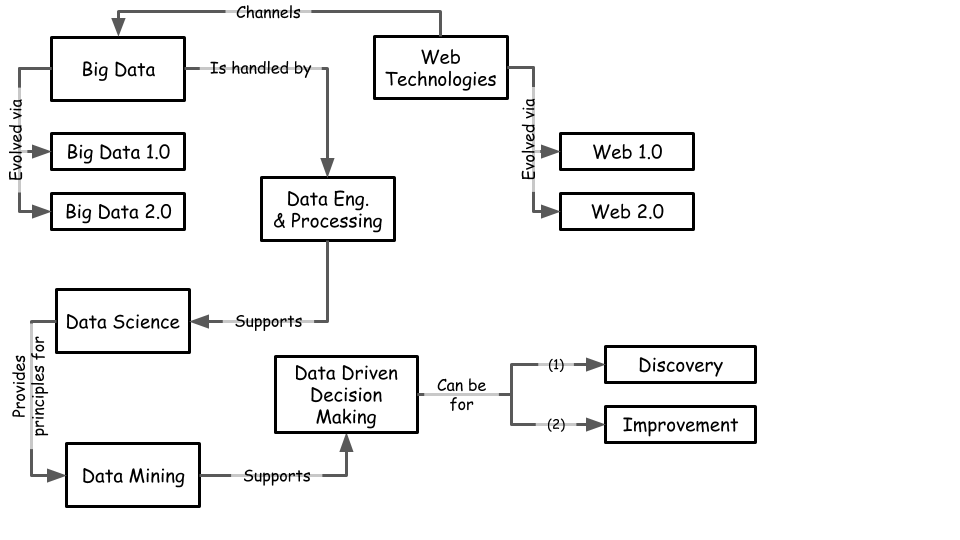
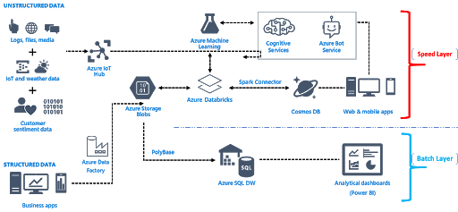

```{r message=TRUE, warning=TRUE, include=FALSE}
library(tidyverse)
library(plotly)
```


# Data Driven Decision Making{#dddm}

```{r lesson-fig, echo=FALSE, fig.align='center', fig.asp=.75, fig.cap='Lesson Map (own work)', message=TRUE, warning=TRUE, out.width='80%'}

```
## Thinking and Deciding

### The Monty Hall Problem

Suppose you're on a game show, and you're given the choice of three doors: Behind one door is a car; behind the others, goats. You pick a door, say No. 1, and the host, who knows what's behind the doors, opens another door, say No. 3, which has a goat. He then says to you, "Do you want to pick door No. 2?" Is it to your advantage to switch your choice?

```{r montyhall-fig, echo=FALSE, fig.align='center', fig.asp=.75, fig.cap='The Monty Hall Problem taken from https://en.wikipedia.org/wiki/Monty_Hall_problem', message=TRUE, warning=TRUE, out.width='80%'}
knitr::include_graphics('images/montyhall.png')
```

  <h3>Solution</h3>
  <p>Before checking, try to derive a solution yourself.</p>
  <button type="button" class="btn btn-info" data-toggle="collapse" data-target="#solution">Solution</button>
  <div id="solution" class="collapse">
  <hr>
    <p>Instead of trying to find an answer by reasoning we could write an algorithm that would play the game for us. Below you see one run</p>

```{r echo=FALSE, message=TRUE, warning=TRUE}
## Initialize doors
doors <- function(cat=TRUE) {
  d <- sample(c(1,0,0), 3)
  if(cat) { cat("There are 3 doors: ", d, "\n") }
  return(d)
}

## Player's choice
choice <- function(doors, cat=TRUE) {
  i <-sample(c(1, 2, 3), 1)
  r <- doors[i]
  if(cat) { cat("Player chose door nr:", i, ", with reward:", r, "\n") }
  return(c(i, r))
}

## Host opens door
open <- function(doors, i, cat=TRUE) {
  doors <- doors[-i]
  r <- sum(doors)
  if(cat) { cat("Host opens door. Remaining door has reward", r, "\n") }
  return(r)
}

start <- doors()
player <- choice(start)
host <- open(start, player[1])
```

<p>and the total wins when eached strategy is tried a 100,000 times.</p>


```{r echo=FALSE, message=TRUE, warning=TRUE}
n <- 100000
score <- 0

play <- function(n, switch = FALSE) {
  
  total <- 0
  
  for (i in 1:n) {
    start <- doors(cat = FALSE)
    player <- choice(start, cat = FALSE)
    host <- open(start, player[1], cat = FALSE)
    score <- if(switch) { host } else { player[2] }
    total <- total + score
  }
  
  return(total)
}

hold <- play(n, switch = FALSE)
switch <- play(n, switch = TRUE)
mhDF <- data.frame(hold, switch) %>% pivot_longer(cols = c("hold", "switch"), names_to = "strategy")

p <- ggplot(mhDF, aes(x = strategy, y = value, fill = strategy)) +
  geom_col() + 
  theme(legend.position="none")

ggplotly(p)
```

<hr>

Apparently you have a `r round(mhDF$value[2]/1000)`% chance of winning when switching doors.

**Think**: The problem was simple. Was it also a simple cognitive task? Do you trust the solution above?

</div>

## What is Data Science and what is not?

```{r datascience-fig, echo=FALSE, fig.align='center', fig.asp=.75, fig.cap='Data Science diagram taken from: https://towardsdatascience.com/introduction-to-statistics-e9d72d818745', message=TRUE, warning=TRUE, out.width='80%'}
knitr::include_graphics('images/datascience.png')
```

What is the ultimate purpose of a Data Science effort?

## What is Data Mining?
```{r crisp-fig, echo=FALSE, fig.align='center', fig.asp=.75, fig.cap='Cross-industry standard process for data mining taken from: https://commons.wikimedia.org/wiki/File:CRISP-DM_Process_Diagram.png', message=TRUE, warning=TRUE, out.width='80%'}
knitr::include_graphics('images/crisp.png')
```

## What is Data Driven Decision Making

What are other types of decision making? (relation with What is proof or evidence?)

```{r dikw-fig, echo=FALSE, fig.align='center', fig.asp=.75, fig.cap='DIKW pyramid taken from: https://en.wikipedia.org/wiki/DIKW_pyramid#/media/File:DIKW_Pyramid.svg', message=TRUE, warning=TRUE, out.width='80%'}
knitr::include_graphics('images/pyramid.png')
```


<iframe width="560" height="315" src="https://www.youtube.com/embed/L3LMbpZIKhQ" frameborder="0" allow="accelerometer; autoplay; clipboard-write; encrypted-media; gyroscope; picture-in-picture" allowfullscreen></iframe>

## What are the challenges and opportunities that Big Data creates?

## What are Big Data technologies?
```{r azure-fig, echo=FALSE, fig.align='center', fig.asp=1, fig.cap='Big Data pipelines taken from: https://azure.microsoft.com/en-gb/blog/the-emerging-big-data-architectural-pattern/', message=TRUE, warning=TRUE, out.width='80%'}

```

```{r technoslavia-fig, echo=FALSE, fig.align='center', fig.asp=1, fig.cap='Big Data pipelines taken from: https://blog.dataiku.com/technoslavia-the-fragmented-world-of-data-infrastructure-in-2020', message=TRUE, warning=TRUE, out.width='80%'}
knitr::include_graphics('images/technoslavia.jpg')
```

## Case Study: Ubernomics


<iframe width="560" height="315" src="https://www.youtube.com/embed/63wt3TgGGxI" frameborder="0" allow="accelerometer; autoplay; clipboard-write; encrypted-media; gyroscope; picture-in-picture" allowfullscreen></iframe>